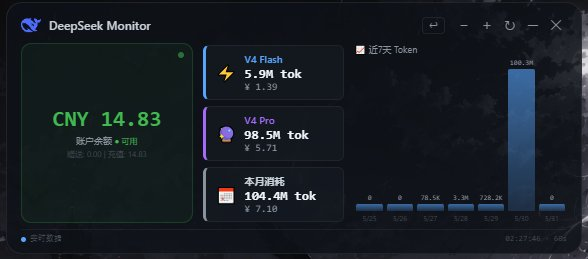
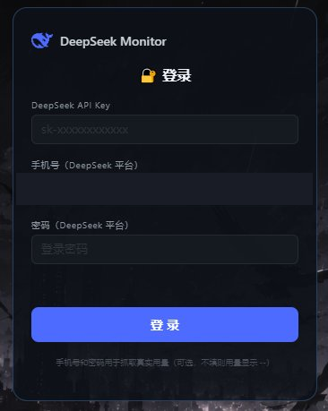

<div align="center">


# DeepSeek API Monitor

**一个悬浮在 Windows 桌面上的 DeepSeek API 用量监控小挂件**  
**A lightweight desktop widget for monitoring your DeepSeek API usage**

[功能特性](#-功能特性) · [截图](#-截图) · [快速开始](#-快速开始) · [English](#english)




</div>

---

## ✨ 功能特性

- 🪟 **桌面置顶悬浮窗** — 半透明毛玻璃效果，无边框，可拖动，双击折叠
- 💰 **账户余额** — 实时调用 DeepSeek API 查询真实余额
- 📊 **用量统计** — Puppeteer 自动登录抓取真实数据（Token 消耗、消费金额、模型明细）
- 📈 **近 7 天图表** — 每日 Token 消耗柱状图，柱顶标注数值
- 🔐 **登录验证** — 首次输入 API Key + 手机号 + 密码，本地加密存储，下次自动登录
- ↩️ **注销切换** — 一键清除凭证返回登录页
- 📌 **系统托盘** — 最小化到托盘，双击显示/隐藏
- 📦 **便携 exe** — `npm run build` 生成单文件，无需安装

---

## 📸 截图

**主界面**


**登录界面**



---

## 🚀 快速开始

**方式一：下载安装包（推荐）**

前往 [Releases](../../releases/latest) 下载 `DeepSeek-Monitor.exe`，双击运行即可。

**方式二：从源码运行**

```bash
git clone https://github.com/YanXiaFengYan/DeepSeek-API-Monitor.git
cd DeepSeek-API-Monitor
npm install
npm start
```

首次启动弹出登录窗口，填入凭据后自动进入主界面。

---

## ⚙️ 配置说明

在项目根目录创建 `.env` 文件（参考 `.env.example`）：

```env
# 必填 — 在 https://platform.deepseek.com/api_keys 创建
DEEPSEEK_API_KEY=sk-xxxxxxxxxxxxxxxx

# 可选 — 填写后可抓取真实用量数据，不填则显示 --
DEEPSEEK_EMAIL=your@email.com
DEEPSEEK_PASSWORD=yourpassword
```

> ⚠️ `.env` 文件已加入 `.gitignore`，不会被上传到 GitHub。

---

## 🖱️ 使用说明

| 操作 | 效果 |
|------|------|
| 拖动窗口 | 移动到屏幕任意位置 |
| 双击 | 折叠 / 展开 |
| 右键 | 菜单：刷新 / 退出 |
| 托盘双击 | 显示 / 隐藏窗口 |
| `npm run shortcut` | 在桌面创建快捷方式 |

---

## 🔧 打包

```bash
npm run build
# → dist/DeepSeek-Monitor.exe（便携版，约 77 MB）
```

---

## 📁 项目结构

```
DeepSeek-API-Monitor/
├── main.js              # Electron 主进程（登录/主窗口/缩放）
├── preload.js           # 安全 IPC 桥接
├── scraper.js           # Puppeteer 自动登录抓取
├── widget.html          # 主界面（悬浮窗）
├── login.html           # 登录界面
├── server.js            # 网页版后端（可选）
├── public/index.html    # 网页版前端（可选）
├── create-shortcut.js   # 桌面快捷方式脚本
├── .env.example         # 凭据模板
├── assets/              # 截图等资源
├── package.json
└── README.md
```

---

## ⚠️ 注意事项

- **不填手机号和密码**：余额正常显示，用量数据显示 `--`
- **首次抓取**：Puppeteer 启动浏览器登录需约 50 秒，完成后缓存 10 分钟
- **API Key**：在 [platform.deepseek.com/api_keys](https://platform.deepseek.com/api_keys) 创建

---

## English

A transparent, always-on-top desktop widget for Windows that monitors your DeepSeek API usage in real time.

**Features:** floating widget · real balance via API · usage scraping via Puppeteer · 7-day chart · auto login · system tray

**Quick start:**
```bash
git clone https://github.com/YanXiaFengYan/DeepSeek-API-Monitor.git
cd DeepSeek-API-Monitor
npm install && npm start
```

See [configuration](#️-配置说明) above for `.env` setup.

---

## 📄 License

MIT © 2026 YanXiaFengYan

---

<div align="center">
  <sub>Built with ❤️ and AI assistance (Reasonix + Claude) · 用 AI 辅助开发构建</sub>
</div>
